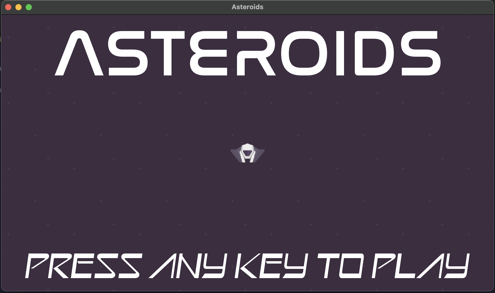

# Asteroids Game

## Description

A simple Asteroids game created using SFML and C++. Destroy asteroids, earn points, and have fun!

## Features

- Intuitive controls
- Asteroids to destroy
- Score tracking

# How to Play 
MAC) Navigate to directory using terminal, and run ./build-run-unix.sh 
WINDOWS) Navigate to directory using "MSYS2 MinGW" terminal, and run ./build-run-win-msys2.sh

